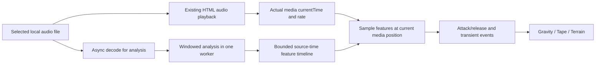

# Audio Features, Timing, and Musical Response

## Boundary

The visualizer is a **read-only consumer of playback state**. Preserve the direct `HTMLAudioElement` output and existing MediaSession behavior. Analyze a decoded copy of the selected track; do not route, duplicate, mute, or restart audible playback to obtain visual data.

This preserves the project's ADR 8 decision, not a claim that a particular audio route is universally required on every Safari version. The implementation must still be tested on the owner's phone. [Project decision](https://github.com/devin-thomas/resample-studio/blob/d4f6323c4388899fe98b8d29eaece08e47816180/DECISIONS.md).

## Why the current feature contract must change

The baseline `getFrequencyData()` uses a nested-loop 128-point DFT, samples every second PCM value, and fills all 128 outputs. The visualizer labels arbitrary index ranges bass/mids/treble. [Engine](https://github.com/devin-thomas/resample-studio/blob/d4f6323c4388899fe98b8d29eaece08e47816180/src/audio/engine.ts) · [Consumer](https://github.com/devin-thomas/resample-studio/blob/d4f6323c4388899fe98b8d29eaece08e47816180/src/components/AudioVisualizer.tsx).

Derived consequences:

- Sampling every second value halves the effective sample rate. Without filtering first, it also aliases higher-frequency content.
- The second half of a real-signal DFT is mirrored frequency information, not a new run of higher audible bands.
- For a 44.1 kHz input in that algorithm, bin spacing is about 172.3 Hz; the range labeled bass includes bin 13, about 2.24 kHz. This is an example calculated from the code, not a measurement of the user's current file.
- A very short slice and direct frame-to-frame mapping are not a useful musical envelope.
- Work increases with display refresh rate even though the audio-information requirement has not changed.

The new analysis must operate independently of rendering, use explicit frequency boundaries, and supply smoothed musical controls. The [Web Audio analysis specification](https://www.w3.org/TR/webaudio/#fft-windowing-and-smoothing-over-time) is a reference for the distinction between windowing, frequency transformation, and temporal smoothing; it does not mandate reconnecting this app's output to an `AnalyserNode`.

## Proposed pipeline



This diagram deliberately shows playback and decoding as parallel consumers of the file, not decoded visualization data as part of the output path.

## Analysis defaults

The following are starting choices, not library requirements or assertions that the repository already implements them.

| Item | Starting implementation |
|---|---|
| FFT | Tested radix-2 implementation in a worker; 2,048 samples at the decoded buffer's actual sample rate |
| Window | Hann, precomputed once per analysis configuration |
| Hop | 512 source samples; timestamp each result at its window center |
| Spectrum | Nonnegative frequencies only; reject DC as a musical-energy cue |
| Broad bands | Bass 30–250 Hz; mids 250–2,000 Hz; highs 2,000–16,000 Hz, bounded by Nyquist |
| Detailed bands | 32 logarithmically spaced display bands over the supported range |
| Level | RMS energy proxy; do not label it LUFS or measured perceptual loudness |
| Brightness | Bounded spectral-centroid-derived control |
| Transients | Positive spectral change with adaptive threshold and a refractory interval; no BPM or instrument-classification promise |

Compute power with explicit normalization; aggregate bands by their frequency bounds rather than magic array indices. Retain numeric headroom and compress to useful visual ranges after analysis. Silence maps to zero, not amplified noise.

For stereo, combine per-channel energy/power rather than relying only on channel zero or naïvely summing opposite-phase samples. A right-only file must drive the visuals. An anti-phase stereo fixture must not disappear through an accidental mono cancellation. This is an artistic energy analysis, not a replacement for the output mix.

Use source sample rate metadata from the decoded buffer. Do not assume every upload is 44.1 or 48 kHz. Do not skip samples as a performance shortcut; any later downsampling needs a proper resampling/filtering step.

### Normalization

Use bounded compression and a noise floor. Favor stable track-level calibration, or slowly adapting calibration during progressive analysis, over renormalizing every frame to its own peak. A quiet passage must stay quieter than a loud one. Avoid a changing normalization denominator that causes a visible jump when more of the file finishes analyzing.

A feature is a continuous control in `[0,1]`, not a calibrated acoustic measurement. Clamp finite values at the analysis/consumer boundary. No `NaN` or infinity reaches geometry.

## Worker, memory, and startup

- Start playback promptly; analysis is not a gate for hearing audio.
- Show the ambient world while analysis is loading or unavailable. Blend into musical response when data exists for the current playhead.
- Use one analysis worker and a generation token for the selected track. Worker messages carry that token; ignore obsolete work after track switches.
- Process bounded chunks and publish usable results progressively. Do not allocate one raw-audio copy per mode or predecode the whole playlist for this feature.
- Transfer scratch/copy buffers, not the buffers that playback/export or an `AudioBuffer` still owns. Reuse chunk storage where safe.
- Keep a bounded cache keyed by track identity and analysis configuration. Start with the active track; add eviction of previous results only if measured benefit justifies it.
- Worker processing does not remove the memory cost of `decodeAudioData`. Account for decoded PCM, transfer scratch, feature storage, and GPU resources separately.
- Define an analysis memory/work limit. For oversized or failed decodes, retain playback and fall back to idle; report the limitation in developer diagnostics without presenting fake musical data.
- Do not create a SharedArrayBuffer / cross-origin-isolation requirement or upload audio to solve this.

## Time contract

Use two clocks with distinct responsibilities:

**Media time** identifies the source location currently playing. Sample features at the engine's actual `currentTime`. Do **not** multiply `currentTime` by `playbackRate` again; playback has already advanced that clock at the selected rate.

**Simulation time** drives material flow, springs, and event decay. Advance it using bounded elapsed wall time while the page is active. It continues a gentle idle motion during silence and pause. It must not jump by the duration of a background suspension.

Expose actual effective playback rate from the engine; do not infer it from a pitch label when the app also supports other control modes.

### Source spectrum versus heard spectrum

Initial scope: bands describe the original decoded source at the correct media position. They are **not** a measurement of the final pitch-shifted/time-stretched output. Changing playback rate changes event timing naturally through media time and may gently change world travel speed.

Do not claim calibrated post-effect bass/highs. Accurate post-processing spectral analysis is a separate feature and must not trigger an audio-routing rewrite in this task. A future varispeed-specific remapping can be explicit; pitch-preserved/time-stretched output cannot be assumed equivalent to simple frequency scaling.

## Envelopes, not direct assignments

Use attack/release followers whose coefficients depend on elapsed seconds. One useful form is:

```ts
// Proposed helper. Values/units must be validated by the caller.
function follow(target: number, current: number, dt: number,
                attackSeconds: number, releaseSeconds: number): number {
  const tau = target > current ? attackSeconds : releaseSeconds;
  const alpha = 1 - Math.exp(-dt / Math.max(tau, 0.001));
  return current + (target - current) * alpha;
}
```

Suggested tuning seeds:

| Control | Attack | Release | Role |
|---|---:|---:|---|
| Bass | 20–40 ms | 250–450 ms | Broad, heavy response |
| Mids | 40–80 ms | 180–300 ms | Sustained material flow |
| Highs | 10–25 ms | 80–180 ms | Small quick detail |
| Overall energy | 80–150 ms | 500–900 ms | Environmental intensity |

These values are proposals. Tune with the test playlist, not just a sine wave. Avoid stacking multiple long smoothers until the visual response trails the music noticeably.

Motion is then derived from these controls. For rotation, integrate a smoothed angular velocity, for example `angle += speed * dt`. Never restore the current `angle = elapsedTime * baseSpeed + rawEnergy * amount` behavior.

## Transients are events

Name detections **transients/onsets**, not guaranteed beats, kicks, or snares. A sustained loud tone should not emit a new impulse every frame.

Use adaptive thresholds, a minimum useful strength, and a short refractory interval as tuning controls. Each event has a source-time position and a stable ordinal within the analyzed track. Emit it when normal playback crosses its position. Rendering it for several frames must not retrigger it.

Use a fixed event-output capacity and fixed per-mode effect pools. When overloaded, coalesce or omit weaker events according to a documented rule rather than allocating endlessly. Events should carry strength and, at most, a coarse low-band/broadband distinction—not unearned instrument labels.

## Lifecycle behavior

| Situation | Required behavior |
|---|---|
| No track | Ambient only; all musical envelopes tend toward zero |
| Decode pending | Ambient; playback unaffected; no reuse of the previous track's features |
| Pause | Stop new musical events; smoothly release envelopes; continue gentle base motion |
| Resume | Resynchronize to current media time; do not replay paused-period events |
| Seek | Reset feature/event cursors and invalidate stale transient effects; no burst from skipped audio |
| Loop | Start a new event epoch so opening events may trigger again exactly once |
| Next/previous/shuffle | Immediately invalidate previous ownership; ignore late decode/worker results |
| Playback-rate change | Preserve media-position synchronization and world-position continuity |
| Hidden page | Pause visual work; do not stop audible playback to save visualization resources |
| Return to foreground | Rebase render time and event cursor to now; no catch-up storm |
| Decode/worker error | Neutral features and ambient visuals; existing transport still works |

When analysis catches up after a delay, do not emit a backlog of historical events. Only events crossed in an active, normal playback interval should be eligible. On every discontinuity use an epoch/reset indicator, as defined in document 04.

## Sampling API behavior

The implementation should fill one reusable `AudioFeatures` frame (document 04). Its scalar controls and band values are already normalized and temporally shaped for use by modes. Its transient event buffer is distinct from the continuous `transientEnvelope`.

Modes may add material-specific springs and propagation, but must not independently run FFTs, infer track state, or create another beat detector.

Retain legacy analysis methods only while other callers need them. Find all callers before changing signatures. Do not silently change the meaning of a method named `getFrequencyData()` while leaving the old guide describing different units.

## Analysis acceptance

Prove silence, a steady low tone, a steady high tone, isolated impulses, right-only stereo, anti-phase stereo, seeking, looping, rapid track switches, and rate changes. State which checks are synthetic, recorded-file, or physical-device checks. A good-looking idle animation is not evidence of correct analysis.
