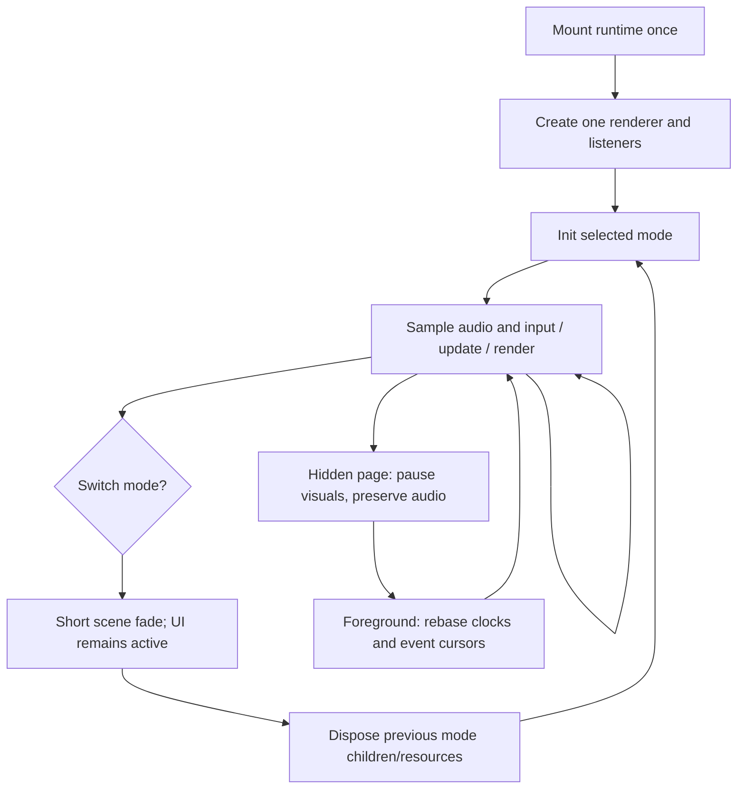

# Runtime, Physical Interaction, and Performance

## Ownership

Retain `src/components/AudioVisualizer.tsx` as the application-facing integration point. It should own or delegate to one runtime, not construct a new renderer whenever the selected mode changes.

Proposed layout; reuse equivalent existing files instead of moving unrelated code:

```text
src/components/AudioVisualizer.tsx       React host and existing mode controls
src/visualizer/
  types.ts                              Shared frame / lifecycle contracts
  runtime.ts                            One renderer, clocks, switching, cleanup
  audioFeatures.ts                       Timeline sampling and envelopes
  interaction.ts                        Pointer lifecycle and input ownership
  motion.ts                             Small damping / spring helpers
  modes/
    Tape.ts
    Gravity.ts
    Terrain.ts
src/workers/audioAnalysisWorker.ts        Windowed analysis, separate from export
```

This is a bounded refactor, not a new engine or plugin platform. The module interface in the existing guide is a starting proposal; the baseline component does not yet implement it as independent classes. [Guide](https://github.com/devin-thomas/resample-studio/blob/d4f6323c4388899fe98b8d29eaece08e47816180/docs/VISUALIZATIONS.md) · [Component](https://github.com/devin-thomas/resample-studio/blob/d4f6323c4388899fe98b8d29eaece08e47816180/src/components/AudioVisualizer.tsx).

## Proposed shared contract

These types define the intended units and responsibilities; they are not existing exported APIs. Adapt names to project conventions while preserving semantics.

```ts
import type * as THREE from 'three';

export type ModeId = 'tape' | 'gravity' | 'terrain';
export type FeatureState = 'idle' | 'loading' | 'ready' | 'unavailable';
export type ResetReason = 'track' | 'seek' | 'loop' | 'resume' | 'context-restored';
export type QualityTier = 'low' | 'balanced' | 'high';

export interface VisualTransient {
  ordinal: number;          // Unique within the current track's event timeline
  mediaTime: number;        // Source seconds
  strength: number;         // 0..1
  kind: 'low-band' | 'broadband'; // Heuristic, not a drum classifier
}

export interface AudioFeatures {
  trackKey: string | null;
  epoch: number;            // Changes on timeline discontinuity
  state: FeatureState;
  mediaTime: number;        // Current source seconds, not rate-multiplied again
  playing: boolean;
  playbackRate: number;     // Actual effective media playback rate
  loudness: number;         // 0..1 smoothed RMS-derived visual energy, not LUFS
  bass: number;             // 0..1 normalized and envelope-shaped
  mids: number;
  highs: number;
  brightness: number;       // 0..1 bounded source spectral-brightness proxy
  bands: Float32Array;      // 32 reusable normalized/enveloped source bands
  transientEnvelope: number; // Continuous decaying control
  events: readonly VisualTransient[]; // Reused fixed-capacity storage
  eventCount: number;       // Only [0, eventCount) is valid this render frame
}

export interface InteractionFrame {
  kind: 'none' | 'mouse' | 'touch' | 'pen';
  active: boolean;
  pressed: boolean;
  x: number;               // Canvas-local normalized coordinates, -1..1
  y: number;               // -1..1; positive is up
  velocityX: number;       // Normalized coordinate units per second
  velocityY: number;
  justPressed: boolean;
  justReleased: boolean;
  cancelled: boolean;
}

export interface Viewport {
  width: number;            // CSS pixels
  height: number;
  pixelRatio: number;       // Effective render scale, not assumed device DPR
}

export interface VisualizationFrame {
  simTime: number;          // Active simulation seconds; excludes hidden backlog
  dt: number;              // Bounded elapsed seconds
  audio: AudioFeatures;
  input: InteractionFrame;
  reducedMotion: boolean;
  presentation: 'studio' | 'chill';
}

export interface ModeContext {
  root: THREE.Group;       // Added/removed by runtime; child resources owned by mode
  camera: THREE.PerspectiveCamera;
  viewport: Viewport;
  quality: QualityTier;
}

export interface StudioVisualization {
  readonly id: ModeId;
  init(context: ModeContext): void;
  update(frame: VisualizationFrame): void;
  resize(viewport: Viewport): void;
  setQuality(quality: QualityTier): void; // May rebuild owned geometry safely
  setVisible(visible: boolean): void;
  reset(reason: ResetReason): void;
  dispose(): void;
}
```

Frames and typed arrays are runtime-owned and reused. A mode must not retain the event-output buffer as history; copy individual event scalars into its own bounded effect pool. Pointer transition flags last one render frame. Clear held input on cancellation and lifecycle changes.

A mode does not own the renderer, subscribe to the audio element, change transport, install global listeners, create another RAF loop, or read the playlist store. It may configure the supplied camera on activation; the runtime resets a known camera baseline before activating a different mode.

## Render clock and motion

Use one `requestAnimationFrame` loop. Derive seconds from its timestamp; do not increment time by `1 / 60`. RAF frequency follows browser scheduling rather than a developer-requested FPS value, and callbacks may stop in hidden pages. [MDN RAF reference](https://developer.mozilla.org/en-US/docs/Web/API/Window/requestAnimationFrame).

Clamp unusually large deltas (a starting maximum of 50 ms is reasonable), and rebase entirely on foreground return. For numerical spring integration, use bounded small substeps or an analytic damped solution; clamping alone does not make an unstable spring stable. Cap catch-up work and discard excessive backlog.

Use time-based damping:

```ts
// Example equations, with seconds as the unit.
const alpha = 1 - Math.exp(-responseRate * dt);
position += (target - position) * alpha;
velocity *= Math.exp(-dragRate * dt);
angle += angularVelocity * dt;
```

The first expression is a smooth follower, **not** itself a mass/spring simulation. A physical release needs stored velocity and a bounded restoring force or an equivalent analytic response. Tune spring stiffness and damping so release visibly overshoots or propagates without sustained oscillation.

For approximate compatibility with an old 60 Hz coefficient, `decay(dt) = pow(decayAt60, dt * 60)`. Prefer explicit rates once tuning is complete. Run the same scripted interaction at 60 and 120 Hz to ensure elapsed-time behavior matches.

## Input ownership: fix the background problem without breaking the app

The baseline puts listeners on the background container while foreground siblings cover much of it. Moving listeners to `window` is not, by itself, a complete fix: it can make knob and playlist gestures disturb the world unintentionally. [App layering](https://github.com/devin-thomas/resample-studio/blob/d4f6323c4388899fe98b8d29eaece08e47816180/src/App.tsx).

### Route a gesture once, at its start

- Use Pointer Events for mouse/touch/pen and handle down, move, up, cancel, and lost capture.
- Use one pointer owner. Mark UI/control regions explicitly, for example `data-visualizer-ignore`, and safe background interaction regions with `data-visualizer-gesture`.
- Exclude knobs, transport, mode selector, sliders, inputs, file dropzone, links, playlist controls, modals, and any scrollable UI surface from drag ownership.
- A root-level listener may observe passive mouse position for gentle hover, but may not suppress or redirect a UI gesture.
- Accept a background drag only on a designated surface. Capture that pointer there so release outside the surface still reaches cleanup.
- Do not install blanket `preventDefault()` or `stopPropagation()` handlers on the entire window.

Pointer capture, `pointercancel`, and `touch-action` are browser mechanisms for governing this interaction; keep their platform behavior distinct from the proposed scene physics. [Pointer Events reference](https://developer.mozilla.org/en-US/docs/Web/API/Pointer_events).

### Studio versus Chill

**Studio:** preserve vertical scrolling and pinch zoom. A designated background area may use `touch-action: pan-y pinch-zoom` for horizontal manipulation. A vertical scroll can cancel that pointer gesture; handle cancellation by releasing the visual force cleanly. Controls keep their existing gesture contracts.

**Chill:** the background has more space for direct one-finger manipulation. A dedicated surface may use `touch-action: pinch-zoom` to permit one-finger scene drags while preserving pinch zoom. Do not apply gesture restrictions to the exit button or player bar. Choose the policy before gesture start rather than changing CSS after the browser has begun deciding ownership.

No invisible full-screen overlay may intercept the studio's controls. Test hit-target ownership instead of relying on z-index intuition.

### Coordinates and release

Map CSS-pixel pointer coordinates using the actual canvas bounding rectangle. Do not use framebuffer pixels or multiply pointer coordinates by DPR. Project onto a stable interaction plane or a mode-specific nearest-curve/surface calculation. Reuse vectors/rays.

Initialize previous position/time on down or first hover. Compute velocity per second from event timestamps, filter it, and clamp it. Do not infer a huge first-sample velocity from a default origin. Pressure is optional enhancement only; normal touch/mouse must feel complete without it.

On pointerup, preserve a bounded release velocity for the mode. On pointercancel, lost capture, blur, visibility change, modal opening, mode switch, or orientation change, clear pressed state and stop applying a held force. Do not synthesize a fling from a cancelled gesture.

## Physical response implementation

Prefer a small control-field simulation over a full physics dependency:

- **Tape:** a few spring-controlled influence points deform a continuous ribbon, with traveling-wave terms for release/transients.
- **Gravity:** a softened local force and bounded circulation perturb coherent procedural paths. No inverse-square singularities or pairwise particle interactions.
- **Terrain:** a damped steering rig plus local height-field disturbances and a seamless history/scroll offset.

GPU-evaluated geometry can use CPU-updated control uniforms. Small spline updates may remain CPU-side if profiled within budget. Do not move every operation into a custom shader before measuring; the current per-frame DFT is also a substantial avoidable workload, and this review did not establish a measured CPU/GPU bottleneck.

## Lifecycle and mode transitions



A short sequential fade is enough initially; do not require two full-resolution render targets merely to crossfade. Queue/coalesce rapid selection changes so partially initialized worlds cannot survive unnoticed. Use deterministic initialization seeds for debugging. Changing modes never restarts the song.

Dispose all owned geometries, materials, textures, and render targets; remove listeners/observers and cancel the one loop on unmount. The runtime owns root-group removal and renderer disposal. On WebGL context loss, stop visual work and keep audio/UI alive; restore or show a quiet fallback without restarting playback. [Three.js cleanup reference](https://threejs.org/manual/en/cleanup.html).

## Performance and accessibility contract

Target the owner's 120 Hz-capable iPhone path, but preserve behavior at 60 Hz and below. 120 FPS offers about 8.33 ms per display interval; this is a budget, not evidence the app meets it.

Start at a bounded effective DPR and adapt conservatively based on sustained frame-time evidence. Quality tiers may reduce mesh density, particle count, effect-pool capacity, render scale, and optional glow before altering the musical behavior. Avoid rapid quality oscillation; cooldowns/hysteresis are required. Never relabel reduced detail as proof of a fixed refresh rate.

Keep audio analysis off the render loop. Avoid application-created object/array allocation in steady-state frame work, React state updates per frame, and avoidable full-buffer uploads. Update the FPS display slowly and initialize it as unknown until measured—not `120` by default. Distinguish callback cadence and render submission from actual displayed-frame verification.

The existing static `120Hz ENGINE` copy should not imply a measured device result. Keep diagnostics compact; no new performance settings panel is required.

Preserve high-contrast controls. Respect reduced motion with no continuous camera travel, weak/static field motion, and localized nonflashing feedback. This is separate from Chill Mode. Pausing or hiding the visualizer must never pause sound. Avoid adding autoplay sound, motion-sensor permissions, or hardware-pressure requirements.
