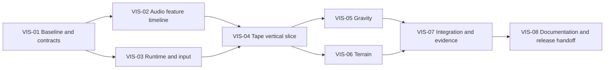

# Delivery Plan and Acceptance

## Handoff to the implementation agent

> Read `01-BRIEF.md` through `04-RUNTIME-AND-INTERACTION.md`, then the current repository instructions, visualization guide, decisions, audio engine, visualizer host, and App layering. Compare the working tree with baseline `d4f6323c4388899fe98b8d29eaece08e47816180` and preserve newer work. Implement the visualization rebuild in small, reviewable stages. Keep audio output, pitch/speed semantics, MediaSession, export, and the existing layout intact. Prove the analysis and gesture path, make Tape convincing first, then build Gravity and Terrain. Update the existing docs rather than leaving conflicting contracts. Do not substitute three differently posed equalizers for the requested worlds. Record actual checks and leave unperformed device/artistic acceptance explicitly pending.

This documentation pack has not implemented or tested the replacement. Source inspection, proposed behavior, unit tests, browser checks, and owner acceptance are different evidence classes.

## Sequence

Do not wait for all three modes to discover that the audio features are poor or touch release is broken. Make each checkpoint runnable. Use the existing package manager and scripts from `package.json`/lockfile; do not introduce a second package-manager lockfile or a CI system for this task.

## VIS-01 — Preserve the baseline and lock integration boundaries

**Work:** inspect current changes, all analyzer callers, source/output routing, Chill Mode, modal behavior, z-index and hit targets. Record a reproducible baseline and the commands that actually exist. Add the new shared contract and concise test fixtures without altering playback.

**Done when:** the integration boundary is explicit, a failure can be isolated or reverted, and the selected track/audio UI still work. No root-level redesign, new backend, or audio-output graph change.

## VIS-02 — Replace the render-loop analysis

**Depends on:** VIS-01.

**Work:** implement the bounded worker/timeline pipeline and sampling contract from document 03. Include sample-rate-aware bands, channel-energy handling, normalization, envelopes, transient ownership, progressive loading, generation guards, seek/loop/rate behavior, and decode failure fallback. Replace analyzer callers deliberately.

**Done when:** analysis tests below pass; render callbacks no longer execute the nested-loop DFT; rapid track changes cannot deliver obsolete data; playback does not wait for full-file analysis or fail when it fails. Capture feature traces for the fixtures before judging any shader.

## VIS-03 — One runtime and explicit physical input

**Depends on:** VIS-01.

**Work:** retain one renderer/RAF host; implement time-based updates, mode lifecycle, resource ownership, safe switching, and gesture routing. Start with a simple diagnostic object/field, not production art. Include release/cancel/lost-capture cleanup, studio scroll protection, Chill interaction, reduced motion, and visibility handling.

**Done when:** background drag/release moves the diagnostic field locally, the same timed input behaves similarly at 60/120 update rates, and knobs/scrolling/playlist controls do not transfer gesture ownership to the scene. Remove development visuals from the normal route before release.

## VIS-04 — Tape vertical slice

**Depends on:** VIS-02, VIS-03.

**Work:** implement continuous material ribbons, broad envelope-driven bends, localized traveling transient pulses, generous near-ribbon grabbing, and damped release. Integrate with real audio and the existing studio/Chill layouts.

**Done when:** Tape passes its four comparison clips and pointer sequence, with no raw-waveform silhouette chatter. Supply a short recording showing idle, playback, pull, and release. Artistic approval may remain an owner gate; do not call it complete solely from a screenshot or build success.

**Checkpoint:** make the flagship convincing before expanding the artistic implementation. Remaining work may proceed provisionally if owner feedback is unavailable, but the unresolved quality gate stays open.

## VIS-05 — Gravity

**Depends on:** VIS-04's shared infrastructure being proven.

**Work:** implement coherent orbital streams, a softened local input force, residual circulation, limited sparks, and propagating disturbances. Reuse analysis/physics helpers, not Tape geometry.

**Done when:** idle flow has an obvious direction, a hand bends nearby trajectories, release leaves a bounded wake, and a transient affects depths sequentially rather than scaling the whole field at once.

## VIS-06 — Terrain

**Depends on:** VIS-04's shared infrastructure being proven.

**Work:** implement a true continuous surface, seamless forward travel, broad musical hills, small high-frequency detail, transient ridges, and restrained steering. Keep the horizon and portrait/landscape composition stable.

**Done when:** terrain moves in silence, recycles without a visible snap, and musical changes do not merely translate the entire floor. Steering is physically distinct from grabbing Tape or disturbing Gravity.

## VIS-07 — Integration, performance, and regression evidence

**Depends on:** VIS-05 and VIS-06.

**Work:** run the matrix below, fix lifecycle/input regressions, measure sustained frame timing and resource counts, and tune balanced/low/high tiers. Verify ordinary studio, Chill Mode, phone portrait/landscape, reduced motion, hidden/foreground return, and WebGL recovery.

**Done when:** measured evidence supports the reported result, unused modes do not keep simulating, repeated switching does not accumulate owned resources, and core audio behavior is preserved. Browser emulation is labeled as such; it does not prove physical Safari touch, background audio, thermal behavior, or ProMotion throughput.

## VIS-08 — Reconcile documentation and hand off

**Depends on:** VIS-07 or an explicit record of remaining acceptance gates.

**Work:** update `docs/VISUALIZATIONS.md`, the visualization sections of `SPEC.md` and `DECISIONS.md`, and affected tickets. Keep the old behavior as historical context where useful, not current instructions. Replace machine-specific `file:///...` links with portable repository-relative links. Replace claims of guaranteed 120 Hz/background playback with target and tested-environment language. Document actual feature units, source-spectrum limitations, clock/reset rules, and mode lifecycle.

**Done when:** a new agent can implement another mode from the real contract without reintroducing raw FFT mapping, shared-geometry pseudo-modes, or a second output path. Provide the diff, check results, recordings, and remaining owner/device checks. Deploy only within the user's existing release authorization; this pack does not independently authorize a production release.

## Analysis and motion tests

Generate small synthetic fixtures locally or use owner-supplied audio. Do not download copyrighted music or claim a generic fixture reproduces the owner's taste.

| Test | Observable pass condition |
|---|---|
| Silence | Musical envelopes settle near zero; no false transient train; ordinary idle remains alive |
| Sustained low tone | Bass dominates; no repeated "beats" just because the level is sustained |
| Sustained high tone | High-band detail responds more than broad bass deformation |
| Single sharp impulse | One bounded transient event, then a decay; no per-frame retrigger |
| Sparse percussion | Separate, legible events with recovery between them |
| Busy compressed mix | Activity increases without all controls clipping or the silhouette buzzing apart |
| Right-only stereo | Visual energy remains present |
| Opposite-phase stereo | Per-channel energy analysis does not cancel into silence |
| Different sample rates | Frequency mapping follows the actual decoded sample rate |
| Seek across many onsets | Land at the new state without emitting all skipped events |
| Loop the opening | Opening events can repeat once per loop epoch |
| Rapid A → B → C track switch | A/B decode or worker completion cannot overwrite C |
| Rate change during playback | Feature timing follows media time; world position stays continuous |
| Pause / resume / foreground | No stale beat burst or giant simulation timestep |
| 60 versus 120 simulation steps | Same elapsed-time motion/release within an agreed numerical tolerance |
| Missing/oversized analysis | Transport continues; visuals fall back honestly to idle |

A suggested initial time-invariance tolerance is 5% for a representative release trajectory sampled at the same wall times. Tighten or document the tolerance according to the numerical method; do not hardcode visually different 60/120 tuning profiles to pass it.

## Interaction and UI tests

Perform these for all modes, with special attention to normal studio versus Chill:

- Press, drag slowly, flick, release outside the original hit area, and cancel a touch. No stuck held force or artificial cancellation fling.
- Drag a pitch/speed knob, scrub the timeline, operate playlist rows, change mode, use Export, upload a file, and exit Chill. The same gesture must not also grab the background.
- Scroll vertically on a phone and pinch zoom where the browser permits. The background may yield cleanly; it must not imprison scrolling.
- Rotate the phone or resize the browser during idle and after a drag. Coordinates and canvas size stay aligned.
- Open a modal during an interaction, switch tabs, return, and switch modes repeatedly. Input and event state reset safely.
- Keyboard users can select modes and operate controls. Reduced-motion users are not forced into camera travel.

## Performance evidence

Use a warm, sustained playback interval, not just the first second of idle. Record device, OS/browser version, power mode, viewport, DPR/render scale, selected quality tier, music fixture, and whether the browser is permitting high-rate RAF.

Report median and tail frame intervals, sustained callback cadence, long stalls, and available CPU/GPU/resource diagnostics separately. Do not infer a GPU bottleneck solely from low FPS. Do not infer 120 displayed frames from an initialized badge or a 60 FPS screen recording.

On the owner's high-rate iPhone path, target a typical interval near 8.33 ms with sufficient headroom that normal interaction does not collapse it. At a browser/device-limited 60 Hz, target stable 16.67 ms pacing and the same motion semantics. These are targets pending measurement, not promised results in this pack.

Run a repeat-switch test (for example 30 Tape → Gravity → Terrain cycles) and inspect owned resource counts after settling. Explain stable engine caches separately from growing application-owned allocations. Check a longer music session for degrading responsiveness or excessive heat; headless screenshots cannot establish this.

## Core regression checklist

- [ ] Upload and play the previously supported formats.
- [ ] Pitch/speed modes, limits, locks, and playback-rate changes preserve existing behavior.
- [ ] Pause, seek, restart, next/previous, repeat, and shuffle preserve existing behavior.
- [ ] Export still produces the intended audio; the analysis worker does not replace or detach export data.
- [ ] On the actual iPhone, app switch / screen lock / return and MediaSession controls work as before.
- [ ] No audio file leaves the browser.
- [ ] No unexpected audible playback is started by visualizer initialization or testing.
- [ ] WebGL/analysis failure leaves controls and playback usable.

## Final artistic acceptance

For each mode answer **yes**, **no**, or **not yet tested**:

1. Does idle look intentionally alive?
2. Does music make it better instead of noisier?
3. Are large and small musical responses visibly different?
4. Can a transient be followed as one event with a beginning and end?
5. Does the hand visibly disturb the world locally?
6. Does release have a satisfying but bounded consequence?
7. Is the mode clearly different from the other two?
8. Are the studio controls still readable and easy to use?

**Do not close the rebuild with only “renders, responds, 120 FPS.”** The owner's judgment of the musical motion and physical feel is part of acceptance.
